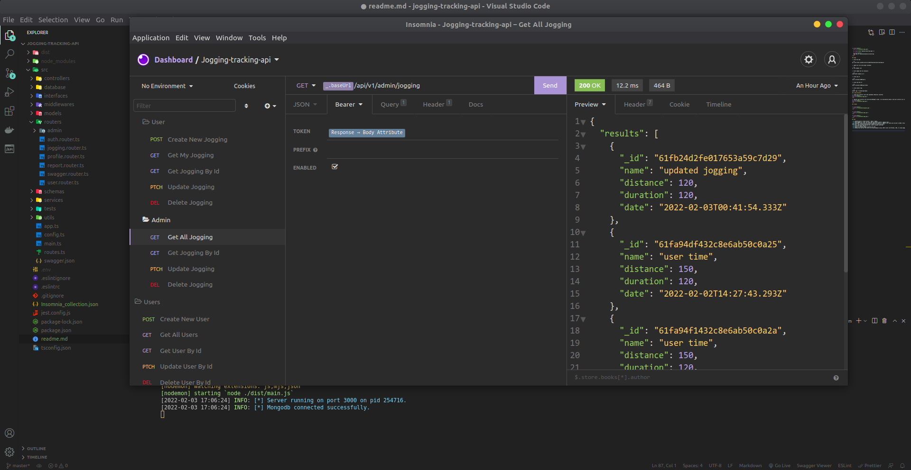
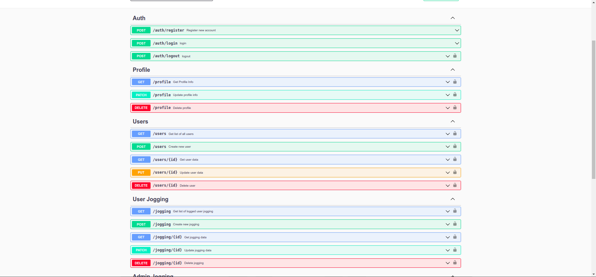

<p align="center">
  

  <h3 align="center">Jogging Tracking API</h3>

  <p align="center">
    Simple demo CRUD Jogging API.
  </p>
</p>

## Usage without docker

1. Clone the repo

```sh
git clone https://github.com/civilcoder55/jogging-tracking-api.git
```

2. make sure you have working mongodb instance


3. update env file with proper variables

```sh
cp .env.example .env
```

4. install npm dependencies

```sh
npm insatll
```

5. to run tests

```sh
npm run test
```
5. to build app

```sh
npm run build
```

6. to run app

```sh
npm start
```

7. access api at

```sh
http://localhost:3000/api/v1
```

8. access api docs at

```sh
http://localhost:3000/api/v1/docs
```

## Usage with docker

1. Clone the repo

```sh
git clone https://github.com/civilcoder55/jogging-tracking-api.git
```

2. update env file with proper variables

```sh
cp .env.example .env
```

3. build images and run containers

```sh
sudo docker-compose up -d
```

4. access api at

```sh
http://localhost:3000/api/v1
```

5. access api docs at

```sh
http://localhost:3000/api/v1/docs
```

6. access docker logs

```sh
docker logs -f jogging-app-nodejs
```

## screens

<p align="center">
  
</p>

<p align="center">
  
</p>

## todo

- [x] Authentication: Create account / login / logout.
- [x] When logged in, a user can view, edit and delete entered `jogging times`.
- [x] Implement three roles with different permission levels: a regular user would only be able to CRUD on their owned records, a user manager would be able to CRUD users, and an admin would be able to CRUD all records and users.
- [x] Each time entry when entered has a date, distance, and time.
- [x] Filter by dates from-to.
- [x] Report on average speed & distance per week.
- [x] Demonstrate how your API works by writing examples using a REST client like Postman, cURL, or using swagger.
